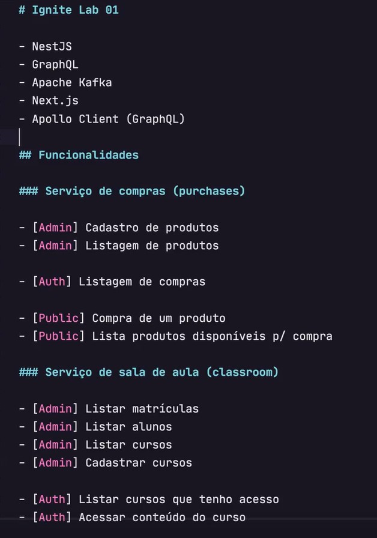

<!-- <div align="center">
  <a href="#"" src=".github/logo.png" width=60%>
  </a>
  <h3 align="center">
      🎓 Plataforma que conecta estudantes e professores que oferecem aulas particulares.. ✨
  </h3>
</div> -->

---

<p align="center">
  <a href="#💻-sobre-projeto">Projeto</a>&nbsp;&nbsp;&nbsp;|&nbsp;&nbsp;&nbsp;
  <a href="#📎-passo-a-passo">Passo a passo</a>&nbsp;&nbsp;&nbsp;|&nbsp;&nbsp;&nbsp;
  <a href="#🎨-layout">Layout</a>&nbsp;&nbsp;&nbsp;|&nbsp;&nbsp;&nbsp;
  <a href="#🚀-como-executar-o-projeto">Executar o projeto</a>&nbsp;&nbsp;&nbsp;|&nbsp;&nbsp;&nbsp;
  <a href="#🛠-tecnologias">Tecnologias</a>&nbsp;&nbsp;&nbsp;|&nbsp;&nbsp;&nbsp;
  <a href="#-author">Author</a>&nbsp;&nbsp;&nbsp;|&nbsp;&nbsp;&nbsp;
</p>

<h2  align="center">


[](./LICENSE)

</h2><br>

</p>

<br>

## 💻 Sobre o projeto

Projeto desenvolvido no **Ignite Lab 0.0** oferecido pela [Rocketseat](https://www.rocketseat.com.br/).

<br>

## 📎 Passo a passo

📌 Criação da base dos serviços

- Criação da base dos micro-serviços back-end e a
- Estruturação do front-end do projeto.
- Setup do processo de autenticação usando o Auth0
- Estrutura da base de dados com Prisma
- Fundamentos da API com GraphQL

<p style="margin-left: 40px">
  
</p>

<br>

## 🎨 Layout

O layout da aplicação está disponível no [Figma]():

<!-- <p align="center">
  
</p> -->

<br>

## 🚀 Como executar o projeto

> 💡 O Frontend precisa que o Backend esteja sendo executado para funcionar.

<br>

#### 🎲 Rodando o Backend (servidor)

```bash

# Clone este repositório
$ git clone git@github.com:nlnadialigia/ignite-lab-0.0.git

# Acesse a pasta do projeto no terminal/cmd
$ cd ignite-lab-0.0

# Vá para a pasta server
$ cd server

# Instale as dependências
$ npm install

# Execute a aplicação em modo de desenvolvimento
$ npm run dev

# O servidor inciará na porta:3333 - acesse http://localhost:3333

```

<br>

#### 🪄 Testando os endpoints

<!-- [](https://app.getpostman.com/run-collection/14773197-0050dc4b-5264-46c6-b670-642c2019332e?action=collection%2Ffork&source=rip_markdown&collection-url=entityId%3D14773197-0050dc4b-5264-46c6-b670-642c2019332e%26entityType%3Dcollection%26workspaceId%3D7971a1b7-792d-4b16-8887-ef0f4b4b3c35#?env%5Blocal%5D=W3sia2V5IjoiYmFzZV91cmwiLCJ2YWx1ZSI6Imh0dHA6Ly9sb2NhbGhvc3Q6MzMzMyIsImVuYWJsZWQiOnRydWUsInR5cGUiOiJkZWZhdWx0In1d) -->

<br>

#### 🧭 Rodando a aplicação web (Frontend)

```bash

# Clone este repositório
$ git clone git@github.com:nlnadialigia/ignite-lab-0.0.git

# Acesse a pasta do projeto no seu terminal/cmd
$ cd ignite-lab-0.0

# Vá para a pasta da aplicação Front End
$ cd web

# Instale as dependências
$ npm install

# Instalar o react-scripts global
$ npm install -g react-scripts

# Execute a aplicação em modo de desenvolvimento
$ npm run start

# A aplicação será aberta na porta:3000 - acesse http://localhost:3000

```

<br>

## 🛠 Tecnologias

- [React](https://reactjs.org/)
- [TypeScript](https://www.typescriptlang.org/)
- [NodeJS](https://nodejs.org/en/)
- [NestJS](https://nestjs.com/)
- [Docker](https://www.docker.com/)
- [Prisma](https://www.prisma.io/)
- [Auth0](https://auth0.com/)
- [GraphQL](https://graphql.org/)

<!--
- **[React Router Dom](https://github.com/ReactTraining/react-router/tree/master/packages/react-router-dom)**
- **[React Icons](https://react-icons.github.io/react-icons/)**
- **[Axios](https://github.com/axios/axios)**
- **[Express](https://expressjs.com/)**
- **[CORS](https://expressjs.com/en/resources/middleware/cors.html)**
- **[KnexJS](http://knexjs.org/)**
- **[SQLite](https://github.com/mapbox/node-sqlite3)**
- **[ts-node](https://github.com/TypeStrong/ts-node)**
-->

**Utilitários**

<!-- - Protótipo: **[Figma](https://www.figma.com/)** -->

- Documentação API: **[Postman](https://www.postman.com/)**

<br>

## 👩‍💼 Autora


&nbsp;&nbsp;&nbsp;&nbsp;&nbsp;&nbsp;&nbsp;&nbsp;&nbsp;&nbsp;[](https://www.linkedin.com/in/nlnadialigia)&nbsp;&nbsp;
[](https://www.instagram.com/nl.nadia.ligia)&nbsp;&nbsp;
[](mailto:nlnadialigia@gmail.com)&nbsp;&nbsp;

---
